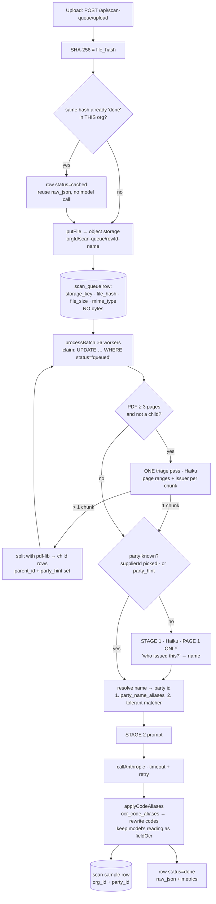

# T-010 — Document scanning (OCR): faster, self-learning, originals kept

> **Last verified: 2026-09-21** against `src/api/lib/ai-http.ts`, `src/api/lib/ocr-learning.ts`,
> `src/api/lib/scan-engine.ts`, `src/api/lib/ocr-distill.ts`, `src/api/lib/ocr-accuracy-core.ts`,
> `src/api/routes/scan-queue.ts`, `src/api/routes/files.ts`, `src/api/routes/scan-po.ts`,
> `src/api/routes/scan-supplier.ts`, `src/api/routes/scan-finance.ts`,
> `migrations-postgres/0233_t010_ocr_scan.sql`, `tests/t010-ocr-scan.test.mjs` — branch
> `feat/t010-ocr-scan`. **Not deployed. Every production figure below is UNMEASURED.**

PRD: `T-010-Hookka-ocr-scan - wei siang.pdf` (Mr Lim, 2026-09-07, priority Low). Requirement
status lives in [`WORK-TRACKER.md`](WORK-TRACKER.md); this file is the design.

## 1. What was actually wrong (read from source, not from the PRD)

| PRD finding | What the code showed |
|---|---|
| Bytes in a DB row | `scan_queue.file_bytes_b64` held the whole file as base64; every auto-split child stored its slice AGAIN; **four hand-copied INSERTs** did it. Object storage already existed (`supabase-storage.ts`, used by `/api/files`) — the queue just never used it. |
| Everyone's rules in one cached prefix | `formatCustomerRules` rendered EVERY customer's block into the single `cache_control` text, 5-minute TTL. One distillation rewrote the prefix for all. |
| Distiller never sees the mistake | `ocr-distill.ts` sent `correctedJson` only. It was also two ~200-line copies (customer / supplier) with **no timeout and no retry**. |
| No correction log | `ocr-accuracy-core.ts` computed which labels changed and discarded the values. `ocr-code-misses.ts` classified code errors into four kinds and fed nothing. |
| Supplier scans without a picked supplier | Not in the PRD: `runSupplierExtract` loaded learned rules only when the operator pre-selected the supplier. Otherwise it scanned with none. |
| Children re-split | Not in the PRD: an auto-split child of ≥3 pages went through the boundary model again, though it was already one document. |
| Hard delete / forced download | `files.ts` `DELETE FROM file_assets` + storage delete; with storage down it dropped the row and orphaned the object. `/stream` hard-coded `attachment`. SO "View original" opens `/stream`. |
| Tenant | `po_scan_samples` reads/writes had no tenant filter (few-shot pool, confirm, by-po GET/PATCH); `scan_queue` used `(org_id = ? OR org_id IS NULL)` in 11 places. |

## 2. Scan flow — two stages, two cache breakpoints



### Stage-2 prompt layout

```
┌─ block 1 ── cache_control {ephemeral, ttl:"1h"} ──────────────────────────────┐
│ universal prompt + CONFIDENCE rule + CATALOG (products, fabrics, variants)     │  shared by every
│                                                                                │  scan in the org
├─ block 2 ── cache_control {ephemeral, ttl:"1h"} ──────────────────────────────┤
│ <customer code="…"> THIS customer's distilled rules </customer>               │  per party
├─ uncached ─────────────────────────────────────────────────────────────────────┤
│ few-shot examples (this tenant, this party first) · the document · instruction │
└────────────────────────────────────────────────────────────────────────────────┘
```

A cache hit needs an identical prefix **up to the breakpoint**. Re-distilling customer A changes
block 2 for A only: block 1 stays warm for everyone, and B's block 2 is untouched. Before, A's
distillation changed the one and only cached block for every customer.

Unidentified document → the old behaviour (PO: all rule blocks; supplier: universal rules
only). Stage 1 can fail without failing the scan.

**Cost of stage 1, stated honestly:** it is one extra model call (Haiku, page 1, `max_tokens`
200, 30 s timeout). It is skipped when the party is already known — supplier picked, or a
split child carrying its parent's `party_hint`. Whether the net effect is the −33 % median the
PRD wants is **UNMEASURED**; `GET /api/scan-queue/stats` exists to measure it (§6).

## 3. Correction loop

```mermaid
flowchart LR
  OP[Operator edits the preview<br/>and saves] --> CF[POST …/samples/:id/confirm]
  CF --> SJ[(sample.correctedJson)]
  CF --> CP[correctionPairs&#40;raw, corrected&#41;<br/>SAME tables + alignment as the<br/>accuracy dashboard]
  CP --> OC[(ocr_corrections<br/>field · line_no · raw_value · final_value · context)]
  CP --> CL{code field?<br/>classifyCodeMiss}
  CL -- unknown_raw --> AT[(ocr_code_aliases<br/>raw → our code, per party)]
  CL -- "real_but_wrong / blank / normalisable" --> NO[no alias]
  OC --> Q[(ocr_distill_queue<br/>one row per party)]
  Q --> DR[cron: drainDistillQueue<br/>ONE party per job, shared deadline]
  DR --> DP[distillPartyRules<br/>examples + CORRECTION PAIRS → Claude]
  DP --> RU[(party.ocrPromptRules)]
  DP --> RV[(ocr_rule_versions<br/>vN · success_rate_before)]
  RV -. "next distill writes vN.success_rate_after" .-> RV
  AT ==>|next scan: deterministic, no model| NEXT[applyCodeAliases]
  RU ==>|next scan: block 2 of the prompt| NEXT2[STAGE 2]
```



Two speeds on purpose. The **alias** is immediate and exact — the very next scan of that
customer's layout returns the corrected code with no model involved (PRD A3/A4). The
**distilled rules** are slower and general. `real_but_wrong` is never aliased: the raw value is
a valid code of ours, and aliasing it would rewrite every genuine use.

Confidence (R11) is model-self-reported: each document carries `lowConfidence: ["items[0].fabricCode", …]`.
It points the reviewer's eye; it does not gate an import.

## 4. Originals

| Rule | Where |
|---|---|
| Bytes in object storage, row keeps key + SHA-256 | `scan-queue.ts` `insertQueueRow` / `loadScanBytes`; `files.ts` POST writes `checksum` |
| Never hard-deleted | `DELETE /api/files/:id` → `archived = TRUE`; consume no longer removes the scan object |
| Posted documents refuse | `files.ts` `POSTED_DOC_CHECKS` → **409 `FILE_LOCKED`** with the reason. Fails closed. |
| Inline view | `/stream` → `inline` for sniff-verified image / PDF / video; `/download?inline=1` → signed URL without the `download` param |
| Access trail | `ocr_file_access_log`, one row per download / view / stream (off the response path) |

`/api/scan-queue/:id/bytes` streams from storage by default and 302s to a signed URL only with
`?redirect=1`. Both in-app callers read the body with `fetch()`; a cross-origin redirect would
hang their source-document capture on the storage host's CORS headers, and that capture has
already broken three times (BUG-2026-08-19-155 / -156, 08-26-168).

### Retention (R19)

- Every scanned original and every `file_assets` object is kept **indefinitely**. Archive hides;
  nothing deletes. There is deliberately no purge job.
- `scan_queue.file_bytes_b64` is legacy. It is read for rows written before the move and
  written only when storage is not configured at all (local dev).
- **Backup: UNMEASURED.** Postgres backups do not include the Supabase Storage bucket
  (`hookka-files`). Whether that bucket is backed up has not been checked. Until it is, the
  originals have one copy.

## 5. Tenant isolation (R13)

Every `scan_queue` read is `org_id = ?`. Every `po_scan_samples` / `supplier_scan_samples` read
and write in the scan routes, the engine's few-shot query and the distiller is tenant-filtered.
Storage keys are `orgId/…`. Rows that pre-date the columns are back-filled (scanner's org, else
the founding org) by the same self-apply that adds the columns, so the strict filter never
meets a NULL.

## 6. Acceptance — how to measure, and what is not known yet

| # | Check | Status |
|---|---|---|
| A1 | `GET /api/scan-queue/stats?days=7` → per kind: p50 / p95 duration, p50 of wait · identify · extract, `slowest_step` | endpoint built · prod **UNMEASURED** |
| A2 | median −33 %; `rowsHoldingBytes` = 0 in the same response | **UNMEASURED** — needs a before/after week. Old rows keep their bytes until `scripts/move-scan-bytes-to-storage.mjs` is run (written, never run). |
| A3 | correct a Houzs Century PO → `ocr_corrections` rows; rescan returns corrected codes | logic proven in `tests/t010-ocr-scan.test.mjs`; live **UNMEASURED** |
| A4 | supplier doc scanned twice picks up the first correction | same |
| A5 | View original displays the PDF | SO + PI wired; GRN / finance have no original yet (R17 open) |
| A6 | delete on a posted document refused; others archive | source-pinned; live **UNMEASURED** |
| A7 | cross-tenant sample / queue reads blocked | source-pinned; live **UNMEASURED** |

Fixture for A3: `TO DO PI-.pdf` (22 pages of Hookka DOs / invoices for Houzs Century).

## 7. Not done

- **R18** base64 photo columns (POD `_helpers.ts`, service cases, attendance, SO page image) →
  file store. Four modules, two of them on the high-risk list; each wants its own change.
- **R17 gaps** finance originals are attached client-side after save (`/api/files`, resourceType
  `OTHER_PARTY_BILL` / `PV`); they are NOT yet in `POSTED_DOC_CHECKS`, so a posted bill's original
  can still be archived. Assistant originals (images / PDFs only) are keyed `ASSISTANT/<userId>`;
  spreadsheets are not kept. The supplier-doc (GRN) modal still has no original (A5).
- **R11 UI, remainder** the SUPPLIER preview modal (`scan-supplier-modal.tsx`, 5.9k lines) does not
  highlight `lowConfidence` yet — only the PO modal does. The review page
  (`/procurement/scan-review`) lists flagged scans and per-kind stats; its "Open scan" link goes to the
  module list, not the exact scan.
- **R10 UI, gap** the finance forms confirm on save, but only `docNo`, party name and line
  descriptions can differ from the raw read (the forms hold no unit price / qty); amount edits are
  not learned.
- **Untested here** none of the new UI was exercised in a browser (no prod login, no DB).
- **R4** covers the synchronous PO path (what the PRD names). The queued PO path uploads the
  uncompressed file on purpose — that upload IS the kept original.
- Legacy-bytes move: `scripts/move-scan-bytes-to-storage.mjs` is written (dry-run by default,
  hash-verified read-back before it NULLs a row) and has **never been run** — how many rows it would
  move is UNMEASURED.
- `tests/db-schema.json` was extended **by hand** from migration 0233 (no DB access from this
  session). Re-run `node scripts/refresh-db-schema-fixture.mjs` after the first deploy.

## 8. Handoff notes (for whoever continues this branch)

Suggested order for §7: R11 UI → R10 UI → R17 → the legacy-bytes move script → R18 (one module
per change, deep review) → PR to `staging`.

Traps met while building this, none of them obvious from the code:

- The Supabase adapter **re-camelCases any result key containing an underscore**. A `SELECT raw_value`
  comes back as `rawValue`. Read new snake_case columns dual-keyed (`r.raw_value ?? r.rawValue`).
  A fake DB in a test returns whatever you hand it, so a test will NOT catch this.
- `supplier_scan_samples` has **lower-cased physical columns** (`rawjson`, `supplierhint`,
  `docidentifier`) — they have no rename-map entry. Un-aliased they read back lower-cased; write
  `rawJson AS "rawJson"`.
- `GET /api/scan-queue/:id/bytes` streams by default **on purpose**; `?redirect=1` is opt-in. Do not
  "finish" R2 by making the redirect the default without first proving the storage host's CORS
  headers against both `fetch()` callers (`so-original.ts`, `scan-queue-client.ts`).
- Model retries are budgeted per caller (`ExtractOpts.aiRetries`): the queue uses the default 2,
  the synchronous routes pass 0 because the browser already retries three times behind a 90 s abort.
- Python/PowerShell patch scripts on this Windows checkout: files are CRLF in the working tree and LF
  in the index (`core.autocrlf=true`). Writing LF is fine; git normalises.
